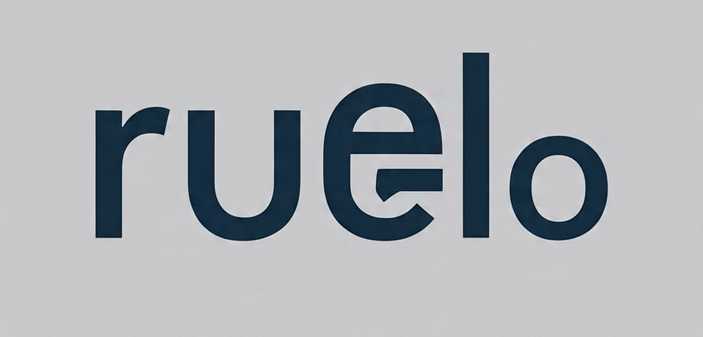

<div align="center">
    
</div>

A powerful face recognition and analysis library for PHP using MediaPipe, with support for file paths, base64 strings, and data URLs.

## What is this?
This package provides robust face recognition, verification, and analysis capabilities using MediaPipe and deep learning models. It supports multiple input formats and provides comprehensive error handling and validation.

## Features
- **Face Verification:** Compare faces between two images with confidence scores
- **Multiple Input Formats:** Support for file paths, base64 strings, and data URLs
- **Base64 Utilities:** Built-in methods for converting between formats
- **Input Validation:** Comprehensive error checking and validation
- **Detailed Results:** Get match status, confidence scores, and similarity metrics
- **Error Handling:** Clear error messages and consistent error format

## Requirements

### PHP Requirements
- PHP 7.2 or higher
- php-fileinfo extension
- php-json extension
- Composer (for PHP dependencies)

### Python Requirements
- Python 3.6 or higher
- mediapipe
- opencv-python
- numpy
- scipy

## Installation
1. **Install the PHP library:**
   ```bash
   composer require theranken/ruelo
   ```

## Usage

### Basic Face Comparison

```php
use Ruelo\DeepFace;

$deepface = new DeepFace();

// Compare two image files
$result = $deepface->compare('path/to/image1.jpg', 'path/to/image2.jpg');
if ($result['match']) {
    echo "Match found! Confidence: " . ($result['confidence'] * 100) . "%\n";
}

// Using a custom threshold (0.0 to 1.0)
$result = $deepface->compare('image1.jpg', 'image2.jpg', 0.5);
```

### Working with Base64 Images

```php
use Ruelo\DeepFace;

$deepface = new DeepFace();

// Convert an image file to base64
$base64 = $deepface->fileToBase64('path/to/image.jpg');

// Compare with mixed formats
$result = $deepface->compare($base64, 'path/to/image2.jpg');

// Compare two base64 images
$base64_1 = $deepface->fileToBase64('image1.jpg');
$base64_2 = $deepface->fileToBase64('image2.jpg');
$result = $deepface->compare($base64_1, $base64_2);

// Working with data URLs
$dataUrl = 'data:image/jpeg;base64,/9j/4AAQSkZJRg...';
$result = $deepface->compare($dataUrl, 'image2.jpg');
```

### Face Analysis

```php
use Ruelo\DeepFace;

$deepface = new DeepFace();

// Basic analysis
$result = $deepface->analyze('path/to/image.jpg');

// Analysis with specific models
$models = ['age', 'gender', 'emotion'];
$result = $deepface->analyze('path/to/image.jpg');
```

### Customizing Python Path

```php
use Ruelo\DeepFace;

// Custom Python interpreter or script path
$deepface = new DeepFace('python3', '/custom/path/deepface_cli.py');

// Or using static methods
$result = DeepFace::compareImages(
    'img1.jpg',
    'img2.jpg',
    'python3',
    '/custom/path/deepface_cli.py',
    0.4  // threshold
);
```

### Using Static Helper Methods

```php
use Ruelo\DeepFace;

// Quick face comparison
$result = DeepFace::compareImages('image1.jpg', 'image2.jpg');

```

### Interactive Usage
You can interact with the library using the CLI tool:
```bash
php interact
```

## Results Format

### Face Comparison Results
```php
[
    'match' => true|false,          // Whether the faces match
    'confidence' => 0.92,           // Match confidence (0 to 1)
    'similarity' => 0.92,           // Similarity score (0 to 1)
    'distance' => 0.08              // Normalized distance
]
```

### Analysis Results
```php
[
    'age' => 25,
    'gender' => 'Man',
    'dominant_emotion' => 'happy',
    'emotion' => [
        'angry' => 0.01,
        'disgust' => 0.0,
        'fear' => 0.01,
        'happy' => 0.95,
        'sad' => 0.02,
        'surprise' => 0.01,
        'neutral' => 0.0
    ]
]
```

### Error Format
```php
[
    'error' => 'Error message description'
]
```

Common error messages:
- 'Both image sources are required'
- 'Image file not found'
- 'Failed to execute Python script'
- 'Invalid JSON response'
- 'Database path not found'

## How It Works
1. The PHP library validates inputs and handles format conversions
2. A Python script using MediaPipe processes the images
3. Results are returned as JSON and parsed into PHP arrays
4. Comprehensive error handling ensures reliable operation

## Troubleshooting

### Installation Issues
- Ensure Python 3.6+ is installed and accessible
- Install all required Python packages: `pip install -r requirements.txt`
- Check file permissions for the Python script

### Input Problems
- Verify image files exist and are readable
- Ensure base64 strings are properly formatted
- Check that data URLs include the correct MIME type

### Docker Usage
If using Python 3 in Docker, you might need to symlink python3:
```shell
RUN ln -s /usr/bin/python3 /usr/bin/python
```

## License
MIT

---

**Built with ❤️ using MediaPipe and PHP**
